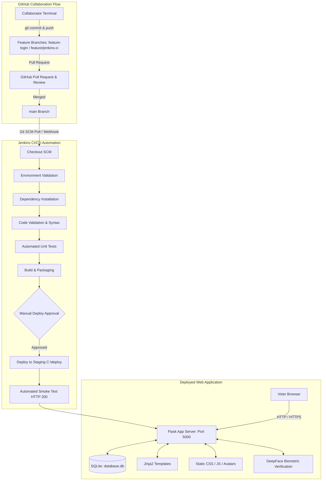

# Online Voting System with Biometric Facial Verification & Jenkins CI/CD

An end-to-end secure electronic voting web application engineered with Python and Flask, featuring facial biometric verification, one-time password (OTP) two-factor authentication, administrative oversight, and an automated continuous integration and continuous deployment (CI/CD) pipeline powered by Jenkins and Git/GitHub.

---

## Table of Contents
- [1. Project Overview](#1-project-overview)
- [2. Features](#2-features)
- [3. Technology Stack](#3-technology-stack)
- [4. Project Architecture](#4-project-architecture)
- [5. Project Structure](#5-project-structure)
- [6. Installation and Setup](#6-installation-and-setup)
- [7. Usage & Application Workflows](#7-usage--application-workflows)
- [8. GitHub Collaboration Workflow](#8-github-collaboration-workflow)
- [9. Jenkins CI/CD Pipeline](#9-jenkins-cicd-pipeline)
- [10. Continuous Deployment (CD)](#10-continuous-deployment-cd)
- [11. Testing](#11-testing)
- [12. Troubleshooting Guide](#12-troubleshooting-guide)
- [13. Contributing Guidelines](#13-contributing-guidelines)
- [14. License and Acknowledgements](#14-license-and-acknowledgements)

---

## 1. Project Overview

The **Online Voting System** is designed to address trust, security, and accessibility challenges in electoral processes. Traditional paper ballots and unverified digital polls are vulnerable to duplicate voting, identity spoofing, and lack of real-time auditability.

This project delivers:
* **Identity Assurance**: Combines password hashing, phone-based OTP verification, and biometric face verification via DeepFace to ensure voters are physically authenticated before casting a ballot.
* **Integrity and One-Vote Enforcement**: Guarantees that each voter can only submit a ballot once (`voted = 1`), with detailed timestamped logging in an auditable database.
* **DevOps Automation**: Employs enterprise-grade CI/CD automation through a multi-stage Declarative `Jenkinsfile` that checks out code from GitHub, validates syntax, installs dependencies, runs automated unit tests, manages a manual approval gate, deploys locally to staging, and executes smoke verification tests.

---

## 2. Features

### 👤 User Registration & Biometrics
* **Demographic Collection**: Captures name, age, gender, email, phone number, and unique username.
* **Biometric Face Capture**: Captures and saves the user's reference portrait to `static/uploads/` during registration.
* **Credential Security**: Passwords are encrypted using Werkzeug's SHA-256 password hashing routines (`generate_password_hash`).

### 📱 Two-Factor Authentication (OTP)
* **One-Time Passcode**: Automatically generates an OTP upon account registration.
* **Account Verification**: Users must verify their OTP via `/verify_otp` before their account status is marked as eligible (`is_verified = 1`).

### 🗳️ Secure Voting & Facial Matching
* **Biometric Verification at Ballot Box**: When casting a vote, the voter submits a webcam capture. DeepFace compares the live snapshot against the stored registration portrait to confirm identity.
* **Duplicate Vote Prevention**: The backend verifies `voted == 0`. Once cast, the voter's status is permanently set to `voted = 1`, blocking subsequent attempts.
* **Voting Receipt**: Automatically generates a unique, timestamped ballot receipt (`/receipt`) confirming candidate selection.

### 📊 Real-Time Election Results
* **Dynamic Ballot Counts**: Live tallying of votes per candidate accessible at `/result`.
* **Visual Standings**: Candidate cards featuring candidate avatars, badges, and current vote counts.

### 🛡️ Admin Dashboard & Governance
* **Election Management**: Protected admin interface (`/admin`) for election officials.
* **Ballot Maintenance**: Add new candidates, update candidate avatars, or remove candidates.
* **Audit & Revocation**: View audit logs (`vote_logs`), monitor voter turnout, and revoke votes if fraudulent activity is identified.

### ⚙️ DevOps & Security Controls
* **Rate Limiting**: Integrated `Flask-Limiter` protects endpoints (`/login`, `/register`, `/vote`) from brute-force and denial-of-service attacks.
* **Security Headers**: Injects `X-Frame-Options: SAMEORIGIN` and `X-Content-Type-Options: nosniff` into HTTP responses.
* **Dark / Light Mode**: Client-side theme toggle with local storage persistence.

---

## 3. Technology Stack

### Backend
* **Python (3.14+)**: Core application runtime.
* **Flask (3.0.0)**: Lightweight WSGI web framework.
* **SQLite3**: Relational embedded database (`database.db`).
* **DeepFace (0.0.101) & TF-Keras**: Facial recognition, verification, and gender detection.
* **Werkzeug (3.1.x)**: Security utilities and password hashing.
* **Flask-Limiter (3.8.0)**: Request rate limiting and IP throttling.
* **Gunicorn (21.2.0)**: Production WSGI server (for Unix/container deployments).

### Frontend
* **HTML5**: Semantic markup with Jinja2 templating.
* **CSS3**: Responsive stylesheet (`static/style.css`) with CSS custom properties for theming.
* **JavaScript (Vanilla)**: Theme toggling, client-side validation, and UI interaction.

### DevOps & CI/CD
* **Git**: Distributed version control and GitHub Flow.
* **GitHub**: Remote repository hosting, branch protection, and Pull Requests.
* **Jenkins**: Automation server executing a Declarative Pipeline with 9 distinct stages.
* **PowerShell & Windows CMD**: Scripting and automation runner on Windows build agents.

---

## 4. Project Architecture

The architecture segregates developer contribution, CI/CD orchestration, web runtime, and persistence:



---

## 5. Project Structure

```text
online_voting_system/
├── .gitignore            # Version control exclusions (__pycache__, database.db, uploads, .env)
├── Jenkinsfile           # 9-stage Declarative Jenkins CI/CD pipeline definition
├── README.md             # Complete project and DevOps documentation
├── app.py                # Core Flask backend (routes, auth, database schemas, face verification)
├── database.db           # SQLite database file (generated at runtime, excluded from Git)
├── requirements.txt      # Python package dependencies (Flask, DeepFace, Limiter, etc.)
├── test_app.py           # Automated unit test suite (compilation, template validation, DB schemas)
├── static/               # Client-side static assets
│   ├── style.css         # UI stylesheet and responsive dark/light mode rules
│   ├── script.js         # Client-side script handling
│   ├── bhargav.png       # Candidate avatar
│   ├── karthikeya.png    # Candidate avatar
│   ├── saketh.png        # Candidate avatar
│   └── uploads/          # Directory storing registered voter face captures
│       └── .gitkeep      # Preserves uploads directory structure in Git
└── templates/            # Jinja2 HTML templates
    ├── home.html         # Landing page
    ├── login.html        # Voter authentication form
    ├── register.html     # Voter registration and photo upload
    ├── verify_otp.html   # OTP two-factor verification
    ├── vote.html         # Ballot paper and face verification
    ├── receipt.html      # Post-vote confirmation receipt
    ├── results.html      # Live candidate vote tallies
    └── admin.html        # Election administration dashboard
```

---

## 6. Installation and Setup

### Prerequisites
* **Operating System**: Windows 10/11, macOS, or Linux.
* **Python**: Python 3.10 to 3.14 installed with `pip` and added to system `PATH`.
* **Git**: Git 2.x installed.
* **Jenkins** *(optional for local app execution, required for CI/CD)*: Jenkins running on port 8080 with Java 17 or 21 LTS.

### Local Setup Instructions

1. **Clone the Repository**:
   ```powershell
   git clone https://github.com/reddykajakarthikeya-sketch/online_voting_system.git
   cd online_voting_system
   ```

2. **Create and Activate a Virtual Environment** *(recommended)*:
   ```powershell
   # Windows PowerShell:
   python -m venv venv
   .\venv\Scripts\Activate.ps1

   # Linux / macOS:
   python3 -m venv venv
   source venv/bin/activate
   ```

3. **Install Dependencies**:
   ```powershell
   python -m pip install --upgrade pip
   pip install -r requirements.txt
   ```

4. **Initialize Database**:
   ```powershell
   python -c "import app; app.init_db(); print('Database schema successfully initialized.')"
   ```

5. **Start Application**:
   ```powershell
   python app.py
   ```
   The application runs by default on `http://127.0.0.1:5000`.

---

## 7. Usage & Application Workflows

### Standard Voter Workflow
1. **Navigate to Home**: Open `http://localhost:5000` and click **Register Free** or navigate to `/register`.
2. **Account Registration**: Complete registration details, attach a clear facial portrait photo, and submit.
3. **Verify OTP**: Input the generated verification code on `/verify_otp`.
4. **Sign In**: Log in at `/login` using registered credentials.
5. **Cast Ballot**: Navigate to `/vote`, select your candidate, provide your live biometric camera capture, and submit your vote.
6. **Download Receipt**: Receive a confirmation receipt on `/receipt`.
7. **View Results**: Visit `/result` to observe live election standings.

### Administrator Workflow
1. Navigate to `/login` and enter administrator credentials.
2. Access the protected dashboard at `/admin`.
3. Add candidate names and upload custom candidate avatar images.
4. Inspect vote logs, review registered users, or revoke compromised votes.

---

## 8. GitHub Collaboration Workflow

The project follows strict **GitHub Flow** to ensure `main` remains production-ready at all times:

```text
main ─────────────────────────────────────────────────────────────► [PR Merged] ──► Jenkins CI/CD
  │                                                                     ▲
  └──► git checkout -b feature/<name> ──► [Commits] ──► git push ───────┤
```

### 1. Feature Branch Creation
No developer commits directly to `main`. Every new capability is developed on an isolated branch:
```powershell
git checkout main
git pull origin main
git checkout -b feature/<feature-name>
```

### 2. Making and Staging Changes
Stage modified files selectively and commit with clear, conventional messages:
```powershell
git add templates/login.html
git commit -m "feat(auth): add autofocus and autocomplete attributes to login form"
```

### 3. Pushing and Upstream Tracking
Push the branch to GitHub:
```powershell
git push -u origin feature/<feature-name>
```

### 4. Opening a Pull Request (PR)
* Open a PR on GitHub targeting `base: main` from `compare: feature/<feature-name>`.
* Include a structured description explaining:
  * Summary of changes.
  * Modified files.
  * Code review checklist (functionality, code quality, security, and tests).

### 5. Review, Approval, and Merging
* Assign peer reviewers (collaborators) in GitHub.
* Review line-by-line diffs in **Files changed**.
* Once approved, merge using **Create a merge commit** to preserve project history.

---

## 9. Jenkins CI/CD Pipeline

The repository integrates a multi-stage Declarative Pipeline (`Jenkinsfile`) designed for Windows environments with UTF-8 encoding support.

### Pipeline Stages Overview

| Stage | Name | Action & Verification |
| :---: | :--- | :--- |
| **1** | **Checkout SCM** | Clones the target commit from `origin/main` into the Jenkins workspace. |
| **2** | **Environment Validation** | Asserts availability of `python`, `pip`, and `git` versions. |
| **3** | **Dependency Installation** | Upgrades `pip` and installs packages from `requirements.txt`. |
| **4** | **Code Validation** | Compiles bytecode using `python -m py_compile app.py test_app.py` to catch syntax errors. |
| **5** | **Automated Testing** | Executes `python -m unittest test_app.py` (3 test suites verifying templates, DB, and syntax). |
| **6** | **Build & Package** | Packages and validates deployable application modules. |
| **7** | **Deploy Approval** | Interactive manual gate prompting the operator: *"Do you want to deploy the application to local staging?"* |
| **8** | **Deploy Locally (Staging)** | Synchronizes production files to `C:\deploy\online_voting_system` and initializes `database.db`. |
| **9** | **Automated Health Check** | Queries Flask test client on `GET /` and asserts HTTP 200 OK. |

### Pipeline Configuration in Jenkins
1. Open Jenkins at `http://localhost:8080`.
2. Click **New Item** → Name: `Online-Voting-System` → Select **Pipeline** → Click **OK**.
3. Under **Pipeline**:
   * **Definition**: `Pipeline script from SCM`
   * **SCM**: `Git`
   * **Repository URL**: `https://github.com/reddykajakarthikeya-sketch/online_voting_system.git`
   * **Branch Specifier**: `*/main`
   * **Script Path**: `Jenkinsfile`
4. Click **Save**.

### Automated Trigger Options
* **Manual**: Click **Build Now** on the job dashboard.
* **Poll SCM**: Configure `H/5 * * * *` to check GitHub for new commits every 5 minutes.
* **GitHub Webhook**: Configure GitHub Repository **Settings → Webhooks** pointing to `http://<JENKINS_HOST>:8080/github-webhook/` (requires a public IP or tunnel like ngrok).

---

## 10. Continuous Deployment (CD)

### Target Environment & Execution
* **Target Path**: `C:\deploy\online_voting_system`
* **Artifact Synchronization**: Uses Windows `xcopy` and `copy` commands to transfer `app.py`, `requirements.txt`, `templates/`, and `static/`.
* **Database Setup**: The pipeline executes `python -c "import app; app.init_db()"` inside the staging directory to provision `users`, `candidates`, and `vote_logs` tables.
* **Automated Smoke Test**: Probes the deployed application directly:
  ```powershell
  cd C:\deploy\online_voting_system
  python -c "from app import app; client = app.test_client(); res = client.get('/'); assert res.status_code == 200; print('Health Check Passed: HTTP 200 OK')"
  ```

### Accessing the Deployed Application
To launch the deployed instance:
```powershell
cd C:\deploy\online_voting_system
python app.py
```
Open **`http://localhost:5000`** in your browser.

---

## 11. Testing

The automated test suite is housed in [`test_app.py`](file:///C:/Users/Kr809/OneDrive/Desktop/online_voting_system/test_app.py) and utilizes Python's standard `unittest` framework:

1. **`test_app_compilation`**: Ensures `app.py` compiles to bytecode without syntax flaws.
2. **`test_templates_exist_and_render`**: Iterates through all 8 Jinja2 HTML templates (`home.html`, `login.html`, `register.html`, `vote.html`, `results.html`, `admin.html`, `verify_otp.html`, `receipt.html`) and verifies they load without template parsing errors.
3. **`test_database_schema`**: Tests table creation in an isolated `:memory:` SQLite instance to verify schema integrity.

### Running Tests Locally

```powershell
# Run with Python standard unittest runner:
python -m unittest test_app.py

# Run with pytest (if installed):
python -m pytest test_app.py -v
```

---

## 12. Troubleshooting Guide

### 1. `UnicodeEncodeError: 'charmap' codec can't encode characters`
* **Symptom**: Jenkins build or terminal fails with `charmap codec can't encode character \u26a0\ufe0f`.
* **Root Cause**: Windows CMD defaults to code page `cp1252`, which cannot print Unicode warning symbols emitted by DeepFace or TensorFlow.
* **Solution**: Ensure `PYTHONUTF8 = '1'` and `PYTHONIOENCODING = 'utf-8'` are defined in the environment.

### 2. `Invalid requirement: UTF-16 Null Bytes in requirements.txt`
* **Symptom**: `pip install -r requirements.txt` throws `Expected semicolon or end`.
* **Root Cause**: Appending to files in PowerShell using `>` or `Out-File` can write UTF-16 LE with null bytes (`\x00`).
* **Solution**: Ensure `requirements.txt` is encoded strictly in UTF-8 without BOM.

### 3. DeepFace / TensorFlow Import Failure
* **Symptom**: Server fails to start if machine learning libraries have version mismatches.
* **Solution**: `app.py` wraps the `DeepFace` import inside a `try...except` block:
  ```python
  try:
      from deepface import DeepFace
  except Exception:
      DeepFace = None
  ```
  This ensures database initialization, authentication, and core routing remain 100% operational.

### 4. Jenkins Port 8080 or Flask Port 5000 Already in Use
* **Check Port Occupancy**:
  ```powershell
  Get-NetTCPConnection -LocalPort 5000 -ErrorAction SilentlyContinue
  Get-NetTCPConnection -LocalPort 8080 -ErrorAction SilentlyContinue
  ```
* **Restart Jenkins Service**:
  ```powershell
  Restart-Service Jenkins
  ```

---

## 13. Contributing Guidelines

1. **Fork or Clone**: Ensure your local copy is synchronized with `upstream/main`.
2. **Create a Feature Branch**: Follow naming conventions:
   * `feature/<feature-name>` for new features.
   * `fix/<bug-description>` for bug fixes.
   * `ci/<pipeline-update>` for Jenkinsfile adjustments.
3. **Validate Locally**: Run `python -m unittest test_app.py` before committing.
4. **Open a Pull Request**: Submit your PR targeting `main`, complete the review checklist, and request a review from a maintainer.
5. **No Direct Pushes to `main`**: All changes must pass CI validation and code review.

---

## 14. License and Acknowledgements

### License
This project is developed for educational, academic, and demonstration purposes.

### Acknowledgements
* **Flask Team**: For the intuitive web framework.
* **DeepFace & Sefik Ilkin Serengil**: For the lightweight face recognition framework.
* **Jenkins Community**: For the open-source automation server.
* **Collaborators & Contributors**:
  * **Karthikeya Reddy** (`reddykajakarthikeya-sketch`)
  * **Bhargav**
  * **Saketh**
