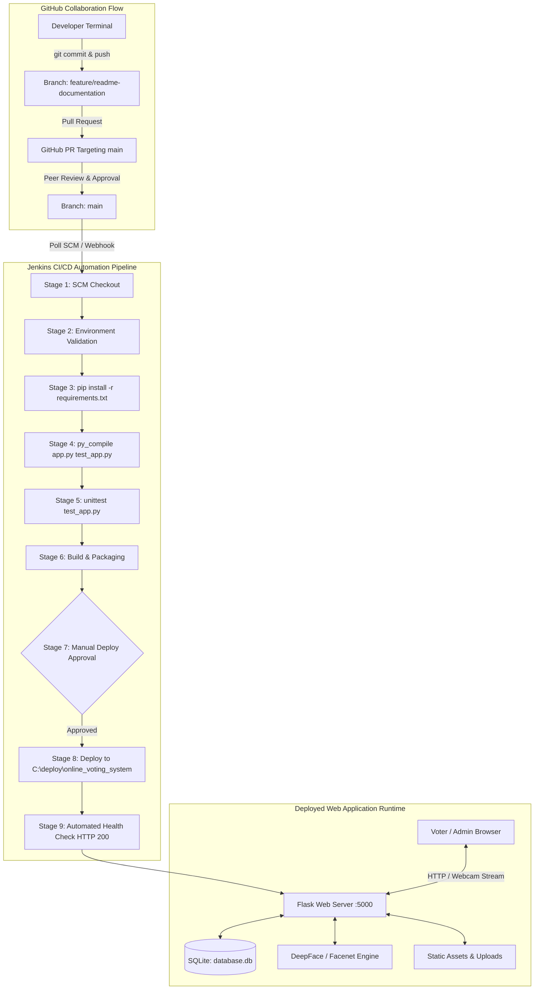

# Online Voting System with Biometric Facial Verification & Jenkins CI/CD

An enterprise-grade, secure electronic voting web application engineered with Python and Flask. The platform features biometric facial verification via DeepFace, cross-voter face deduplication, gender consistency checks, administrative fraud auditing with IP anomaly detection, and a fully automated continuous integration and continuous deployment (CI/CD) pipeline orchestrated with Jenkins and GitHub.

---

## Table of Contents
- [1. Project Overview](#1-project-overview)
- [2. Key Features](#2-key-features)
  - [Voter Authentication & Security](#voter-authentication--security)
  - [Biometric Verification & Anti-Impersonation](#biometric-verification--anti-impersonation)
  - [Ballot Casting & Election Lifecycle](#ballot-casting--election-lifecycle)
  - [Real-Time Results & Live Analytics](#real-time-results--live-analytics)
  - [Administrative Governance & Fraud Auditing](#administrative-governance--fraud-auditing)
- [3. Technology Stack](#3-technology-stack)
- [4. System Architecture](#4-system-architecture)
- [5. Repository Structure](#5-repository-structure)
- [6. Installation & Local Setup](#6-installation--local-setup)
  - [Prerequisites](#prerequisites)
  - [Step-by-Step Installation](#step-by-step-installation)
  - [Default Pre-seeded Credentials](#default-pre-seeded-credentials)
- [7. Application Usage & Workflows](#7-application-usage--workflows)
  - [Standard Voter Workflow](#standard-voter-workflow)
  - [Administrator Governance Workflow](#administrator-governance-workflow)
- [8. GitHub Collaboration Workflow](#8-github-collaboration-workflow)
- [9. Jenkins CI/CD Pipeline](#9-jenkins-cicd-pipeline)
  - [Pipeline Architecture & Stages](#pipeline-architecture--stages)
  - [Windows UTF-8 Encoding Fix](#windows-utf-8-encoding-fix)
  - [Jenkins Job Configuration](#jenkins-job-configuration)
- [10. Continuous Deployment (CD) & Staging](#10-continuous-deployment-cd--staging)
- [11. Automated Testing Suite](#11-automated-testing-suite)
- [12. Troubleshooting & Diagnostics](#12-troubleshooting--diagnostics)
- [13. Contributing Guidelines](#13-contributing-guidelines)
- [14. License & Credits](#14-license--credits)

---

## 1. Project Overview

The **Online Voting System** provides a tamper-resistant, auditable digital balloting platform designed to resolve identity fraud, double voting, and auditability deficits in modern elections.

### Core Objectives
* **Identity & Demographic Integrity**: Protect user registration and login with SHA-256 password hashing (Werkzeug), HTTP-only cookies, and IP-based rate limiting.
* **Biometric Verification at Ballot Submission**: Utilize computer vision and deep learning (`DeepFace` with `Facenet` and `OpenCV`) to enforce:
  1. **Gender Consistency**: Cross-checks registered demographic gender against real-time facial analytics.
  2. **Anti-Sybil / Deduplication**: Cross-checks the voter's live webcam snapshot against all historical voting snapshots to prevent one individual from casting votes across multiple user accounts.
* **Tamper-Evident Receipts**: Issues a cryptographic, unique receipt (`VOTE-<HEX>`) upon ballot confirmation for independent voter verification.
* **DevOps Excellence**: Automates build validation, syntax compilation, unit testing, manual deployment gating, staging synchronization (`C:\deploy\online_voting_system`), and automated HTTP smoke checks via a declarative 9-stage Jenkins pipeline.

---

## 2. Key Features

### Voter Authentication & Security
* **User Registration (`/register`)**: Collects first name, last name, age, gender, email, username, and password. Rate-limited to **3 requests per minute** to thwart bot automated registrations.
* **Secure Credential Storage**: Passwords are saved exclusively as salted SHA-256 hashes generated by `werkzeug.security.generate_password_hash`.
* **Session Protection**: Hardened session cookies configured with `SESSION_COOKIE_HTTPONLY = True` and `SESSION_COOKIE_SAMESITE = 'Lax'`.
* **Security Response Headers**: Every response injects `X-Frame-Options: SAMEORIGIN` (clickjacking mitigation) and `X-Content-Type-Options: nosniff` (MIME-sniffing prevention).
* **Two-Factor Authentication Support (`/verify_otp`)**: Dedicated verification handler supporting OTP validation against database records.

### Biometric Verification & Anti-Impersonation
* **Live Webcam Integration**: The ballot submission interface (`/vote`) accesses voter hardware via HTML5 `navigator.mediaDevices.getUserMedia` and captures a live camera frame onto a hidden `<canvas>`.
* **Gender Analysis Check**: Analyzes live voter imagery via `DeepFace.analyze(photo_path, actions=['gender'], enforce_detection=False)`. If a voter registered as Male exhibits dominant gender prediction of `woman` (or vice-versa), the vote is rejected and the uploaded snapshot is purged.
* **Anti-Impersonation / Cross-Voter Facial Deduplication**: Compares the live face snapshot against all past voter snapshots in `vote_logs` using `DeepFace.verify` with the `Facenet` model and `opencv` detector. If a match is detected (`result["verified"] == True`), the ballot is rejected with an explicit notification that the face was previously used.
* **Graceful ML Degradation**: Wrapped in a resilient `try...except` block in `app.py`, allowing the platform to run seamlessly even on minimal environments without GPU acceleration.

### Ballot Casting & Election Lifecycle
* **Candidate Selection**: Dynamic ballot grid rendering candidate details and custom avatar graphics (`static/bhargav.png`, `static/karthikeya.png`, `static/saketh.png`).
* **Strict Single-Vote Enforcement**: Enforces `voted == 0` check; upon submission, atomically marks `voted = 1` in `users` and records ballot metadata in `vote_logs`.
* **Rate-Limited Ballot Casting (`/cast_vote`)**: Restricted to **1 vote per second** to prevent automated ballot stuffing.
* **Election Countdown & Deadline Locking**: Global election deadline stored in SQLite `settings` table. When `datetime.now() >= election_deadline`, ballot submission is locked, and voters are redirected to results. Real-time endpoint `/api/deadline` provides status to the UI countdown timer.
* **Digital Ballot Receipt (`/receipt`)**: Generates an auditable receipt with a unique identifier (`VOTE-XXXXXXXXXX`), timestamp, and selected candidate name.

### Real-Time Results & Live Analytics
* **Public Tally (`/results`)**: Displays live standings and vote totals per candidate sorted descending.
* **REST API Endpoint (`/api/results`)**: Returns real-time JSON candidate vote tallies (`[{"name": "...", "votes": N}]`) for asynchronous polling and client charts.

### Administrative Governance & Fraud Auditing
* **Restricted Administration Portal (`/admin`)**: Exclusively accessible to authenticated `admin` accounts.
* **Comprehensive Audit Trail**: Displays complete voting transaction logs, voter username, selected candidate, timestamp, voter IP address, and voter facial snapshots.
* **IP Anomaly Detection**: Automatically flags IP addresses that submitted multiple votes (`GROUP BY ip_address HAVING count > 1`) to alert election supervisors to ballot stuffing or shared proxy anomalies.
* **Ballot Maintenance**: Live additions (`/admin/candidate/add`) and deletions (`/admin/candidate/delete/<id>`) of candidate entries.
* **Election Deadline Adjustment**: Real-time modification of the election cutoff timestamp (`/admin/settings/deadline`).
* **Vote Revocation (`/revoke_vote/<id>`)**: Administrative action to invalidate fraudulent votes, automatically decrementing candidate vote tallies, resetting user status to `voted = 0`, and purging the log entry.
* **Audit CSV Export (`/admin/export`)**: Exports complete voting logs as a downloadable CSV (`vote_logs.csv`) containing Receipt ID, Timestamp, Username, Candidate Picked, and IP Address.

---

## 3. Technology Stack

| Layer | Component | Version / Specification | Description |
| :--- | :--- | :--- | :--- |
| **Backend Runtime** | Python | 3.10+ / 3.14 | Core language runtime |
| **Web Framework** | Flask | 3.0.0 | Lightweight WSGI web framework |
| **WSGI Server** | Gunicorn | 21.2.0 | Production-ready HTTP WSGI server |
| **Database** | SQLite3 | 3.x (Built-in) | Serverless relational storage (`database.db`) |
| **Biometric ML** | DeepFace & TF-Keras | 0.0.101 | Face recognition, Facenet verification, gender analysis |
| **Security & Rate Limiting** | Werkzeug & Flask-Limiter | 3.1.x / 3.8.0 | Password hashing, security headers, IP request throttling |
| **Frontend** | HTML5 / Jinja2 / CSS3 / JS | Semantic / CSS Vars | Responsive dark/light theme, webcam canvas streaming |
| **CI/CD Automation** | Jenkins | 2.400+ Declarative | 9-stage automated validation, testing, deployment |
| **VCS & Hosting** | Git / GitHub | 2.x | GitHub Flow, pull requests, branch protection |

---

## 4. System Architecture



---

## 5. Repository Structure

```text
online_voting_system/
├── .gitignore            # Excludes bytecode (__pycache__), database.db, dynamic uploads, virtual environments
├── Jenkinsfile           # 9-stage Declarative Jenkins CI/CD pipeline definition with UTF-8 support
├── README.md             # Authoritative technical and operational documentation
├── requirements.txt      # Project Python dependencies (Flask, Gunicorn, DeepFace, tf-keras, Flask-Limiter)
├── test_app.py           # Automated test suite (syntax compilation, template parsing, schema creation)
├── app.py                # Core Flask backend (routing, SQLite schemas, DeepFace verification, admin API)
├── database.db           # SQLite database generated at runtime (pre-seeded with demo candidates/users)
├── static/               # Client-side static assets
│   ├── style.css         # Responsive styling, glassmorphism design, and dark/light mode themes
│   ├── script.js         # Client-side helpers
│   ├── bhargav.png       # Candidate avatar: Bhargav
│   ├── karthikeya.png    # Candidate avatar: Karthikeya
│   ├── saketh.png        # Candidate avatar: Saketh
│   └── uploads/          # Directory holding captured biometric vote JPEG files (receipt_id.jpg)
└── templates/            # Jinja2 presentation templates
    ├── home.html         # Landing page
    ├── login.html        # Authentication interface
    ├── register.html     # Voter demographic sign-up interface
    ├── verify_otp.html   # OTP two-factor verification screen
    ├── vote.html         # Candidate ballot selection with live webcam capture stream
    ├── receipt.html      # Post-ballot cryptographic receipt display
    ├── results.html      # Real-time election standings and leaderboard
    └── admin.html        # Restricted administrative audit and election oversight dashboard
```

---

## 6. Installation & Local Setup

### Prerequisites
* **Operating System**: Windows 10/11, macOS, or Linux.
* **Python**: Python 3.10 to 3.14 (with `pip` and added to system `PATH`).
* **Git**: Git 2.x installed.
* **Webcam**: Required for biometric face snapshot capture during vote submission.
* **Jenkins** *(optional for local testing; required for pipeline orchestration)*: Java 17/21 LTS with Jenkins on port 8080.

### Step-by-Step Installation

1. **Clone the Repository**:
   ```bash
   git clone https://github.com/reddykajakarthikeya-sketch/online_voting_system.git
   cd online_voting_system
   ```

2. **Create and Activate a Virtual Environment**:
   ```powershell
   # Windows (PowerShell):
   python -m venv venv
   .\venv\Scripts\Activate.ps1

   # Linux / macOS:
   python3 -m venv venv
   source venv/bin/activate
   ```

3. **Install Dependencies**:
   ```powershell
   python -m pip install --upgrade pip
   pip install -r requirements.txt
   ```

4. **Initialize the Database**:
   ```powershell
   python -c "import app; app.init_db(); print('Database schemas initialized successfully.')"
   ```

5. **Start the Development Server**:
   ```powershell
   python app.py
   ```
   Access the running application at **`http://localhost:5000`**.

### Default Pre-seeded Credentials

When `app.init_db()` executes, it automatically configures default candidates and accounts if the tables are empty:

| Username | Default Password | Role | Purpose |
| :--- | :--- | :--- | :--- |
| `admin` | `admin123` | Administrator | Access `/admin` audit dashboard, candidate controls, and logs |
| `harshith` | `password123` | Voter | Pre-configured eligible voter account |
| `pragnay` | `password123` | Voter | Pre-configured eligible voter account |
| `yashwnath` | `password123` | Voter | Pre-configured eligible voter account |
| `chandra` | `password123` | Voter | Pre-configured eligible voter account |

*Pre-seeded Candidates*: **Saketh**, **Karthikeya**, **Bhargav**.

---

## 7. Application Usage & Workflows

### Standard Voter Workflow

1. **Accessing the Portal**: Open `http://localhost:5000`. Unauthenticated visitors land on the Login screen.
2. **Registration**: Navigate to `/register` to create a new profile (first name, last name, age, gender, email, username, password).
3. **Authentication**: Sign in at `/login`. Successful authentication starts a secure session and routes to `/vote`.
4. **Casting a Ballot (`/vote`)**:
   - Verify the countdown timer indicates voting is open.
   - Choose a candidate card.
   - Grant browser webcam access. The system activates the live preview stream and prepares the hidden canvas capture.
   - Click **Submit Secure Vote**.
5. **Biometric Validation (`/cast_vote`)**:
   - The server decodes the webcam snapshot to `static/uploads/<receipt_id>.jpg`.
   - `DeepFace` verifies gender alignment with the registered gender.
   - `DeepFace` verifies that this facial image has not been registered in past `vote_logs` under another identity.
   - If validations pass, votes increment, voter status locks (`voted = 1`), and a unique receipt is stored.
6. **Digital Receipt**: Automatically redirected to `/receipt` to view and save the official ballot confirmation.
7. **Viewing Results**: Check live vote tallies at `/results`.

### Administrator Governance Workflow

1. Sign in with username `admin` and password `admin123`.
2. Navigate to `/admin`.
3. **Audit Trail**: Review all cast ballots, timestamps, chosen candidates, voter IP addresses, and captured face snapshots.
4. **IP Anomaly Detection**: Review the highlighted alert banner showing IPs that cast multiple votes.
5. **Vote Invalidation**: If an anomaly or fraud is verified, click **Revoke Vote** to roll back candidate votes, reactivate voter eligibility, and purge the audit record.
6. **Election Schedule**: Set new election cutoff deadlines via the ISO datetime picker.
7. **Candidate Management**: Dynamically add new candidates or remove existing ones from the ballot.
8. **Export**: Click **Export Audit Log (CSV)** to download `vote_logs.csv`.

---

## 8. GitHub Collaboration Workflow

The project adheres to **GitHub Flow** to ensure high code quality, peer review, and zero downtime on the `main` branch.

```text
main ─────────────────────────────────────────────────────────────► [PR Approved & Merged] ──► Jenkins CI/CD
  │                                                                     ▲
  └──► git checkout -b feature/<task> ──► [Commits] ──► git push ───────┤
```

### Collaboration Steps

1. **Synchronize Main**:
   ```powershell
   git checkout main
   git pull origin main
   ```

2. **Branch from Main**:
   Use structured naming conventions (`feature/*`, `fix/*`, `docs/*`, `ci/*`):
   ```powershell
   git checkout -b feature/readme-documentation
   ```

3. **Stage and Commit Changes**:
   Stage only the relevant files and adhere to Conventional Commits:
   ```powershell
   git add README.md
   git commit -m "docs: add comprehensive project README"
   ```

4. **Push Upstream**:
   ```powershell
   git push -u origin feature/readme-documentation
   ```

5. **Open Pull Request (PR)**:
   - Target `base: main` from `compare: feature/readme-documentation`.
   - Provide a concise description of changes, motivation, test verification, and file impacts.
   - Request review from team members.

6. **Peer Review & Non-Fast-Forward Merge**:
   - At least one peer review is required before merging.
   - Merge into `main` using **Create a merge commit** to preserve traceable history.

---

## 9. Jenkins CI/CD Pipeline

The project incorporates an automated Declarative Pipeline via `Jenkinsfile` executing across 9 discrete stages on Windows build agents.

### Pipeline Architecture & Stages

| Stage # | Stage Name | Description & Execution Commands |
| :---: | :--- | :--- |
| **1** | **Checkout SCM** | Fetches the latest source code from GitHub repository (`checkout scm`). |
| **2** | **Environment Validation** | Validates build agent prerequisites (`python --version`, `pip --version`, `git --version`). |
| **3** | **Dependency Installation** | Upgrades `pip` and installs dependencies from `requirements.txt`. |
| **4** | **Code Validation** | Enforces syntax validation and bytecode compilation: `python -m py_compile app.py test_app.py`. |
| **5** | **Automated Testing** | Executes unit tests via `python -m unittest test_app.py` covering compilation, templates, and database schemas. |
| **6** | **Build & Package** | Generates verified bytecode build artifacts: `python -m py_compile app.py`. |
| **7** | **Deploy Approval** | Interactive manual gate pausing execution for operator authorization: `input message: 'Do you want to deploy the application to local staging?', ok: 'Deploy'`. |
| **8** | **Deploy Locally (Staging)** | Synchronizes files to `C:\deploy\online_voting_system` via `xcopy` and provisions schemas via `python -c "import app; app.init_db()"`. |
| **9** | **Automated Health Check** | Executes an automated smoke test against the deployed instance: verifies `GET /` responds with `HTTP 200 OK`. |

### Windows UTF-8 Encoding Fix

Windows consoles default to Code Page 1252 (`cp1252`), which causes fatal `UnicodeEncodeError` exceptions when deep learning libraries (TensorFlow, DeepFace) or test runners output Unicode characters.

The pipeline explicitly enforces UTF-8 encoding across all Windows batch steps via top-level environment variables:

```groovy
environment {
    PYTHONUTF8 = '1'
    PYTHONIOENCODING = 'utf-8'
}
```

### Jenkins Job Configuration

1. Log into Jenkins (`http://localhost:8080`).
2. Select **New Item** → Name: `online-voting-system` → Choose **Pipeline** → Click **OK**.
3. Under the **Pipeline** configuration tab:
   * **Definition**: `Pipeline script from SCM`
   * **SCM**: `Git`
   * **Repository URL**: `https://github.com/reddykajakarthikeya-sketch/online_voting_system.git`
   * **Branches to build**: `*/main`
   * **Script Path**: `Jenkinsfile`
4. Click **Save** and trigger builds manually via **Build Now** or via GitHub Webhooks.

---

## 10. Continuous Deployment (CD) & Staging

* **Staging Target**: `C:\deploy\online_voting_system`
* **File Synchronization**: The pipeline copies `app.py`, `requirements.txt`, `templates/`, and `static/` directly to the deployment directory.
* **Database Migration**: Executes schema initialization inside the staging directory to ensure tables (`users`, `candidates`, `vote_logs`, `settings`) are created.
* **Automated Smoke Test Verification**:
  ```powershell
  cd /d "C:\deploy\online_voting_system"
  python -c "from app import app; client = app.test_client(); res = client.get('/'); assert res.status_code == 200, f'Expected 200, got {res.status_code}'; print('Health Check Passed: HTTP 200 OK')"
  ```
* **Launching Deployed Staging Instance**:
  ```powershell
  cd C:\deploy\online_voting_system
  python app.py
  ```

---

## 11. Automated Testing Suite

Automated testing is maintained in [`test_app.py`](file:///C:/Users/Kr809/OneDrive/Desktop/online_voting_system/test_app.py) using Python's built-in `unittest` runner:

1. **`test_app_compilation`**: Compiles `app.py` using `py_compile.compile` with `doraise=True` to catch syntax defects before packaging.
2. **`test_templates_exist_and_render`**: Loads Jinja2 file-system environment and verifies that all 8 primary application templates exist and parse cleanly without syntax errors:
   - `home.html`, `login.html`, `register.html`, `vote.html`, `results.html`, `admin.html`, `verify_otp.html`, `receipt.html`.
3. **`test_database_schema`**: Instantiates an isolated in-memory SQLite database (`:memory:`), executes table definitions for `users`, `candidates`, and `vote_logs`, and queries `sqlite_master` to assert all schema components are intact.

### Executing Tests Locally

```powershell
# Standard Python unittest:
python -m unittest test_app.py

# Verbose execution with discovery:
python -m unittest -v test_app.py

# Pytest execution (if installed):
python -m pytest test_app.py -v
```

---

## 12. Troubleshooting & Diagnostics

### 1. `UnicodeEncodeError: 'charmap' codec can't encode character`
* **Symptom**: Jenkins build or Windows CMD crashes when printing emojis or ML library logs.
* **Remedy**: Set environment variables before running Python:
  ```powershell
  $env:PYTHONUTF8="1"
  $env:PYTHONIOENCODING="utf-8"
  ```
  *(Already configured globally in `Jenkinsfile`).*

### 2. DeepFace / TensorFlow First-Run Initialization
* **Symptom**: The first vote verification takes several seconds.
* **Remedy**: DeepFace automatically downloads pre-trained `Facenet` model weights (~90 MB) into `~/.deepface/weights/` on its first invocation. Ensure an active Internet connection during the initial run. Subsequent verifications will use the local cached weights.

### 3. Port Conflicts (`Address already in use: 5000` or `8080`)
* **Symptom**: Flask fails to bind to port 5000, or Jenkins fails on port 8080.
* **Remedy**: Identify and terminate the occupying process in PowerShell:
  ```powershell
  # Find PID occupying port 5000:
  Get-NetTCPConnection -LocalPort 5000 -ErrorAction SilentlyContinue | Select-Object OwningProcess

  # Terminate process by PID:
  Stop-Process -Id <PID> -Force
  ```

### 4. Database Locked (`sqlite3.OperationalError: database is locked`)
* **Symptom**: Concurrent write contention causes SQLite locking exceptions.
* **Remedy**: Ensure long-running transactions close cursors and database connections immediately inside `finally` blocks. Ensure write permissions on `database.db`.

---

## 13. Contributing Guidelines

We welcome contributions! Please adhere to our standardized process:

1. **Fork or Clone**: Keep your clone updated with `origin/main`.
2. **Feature Branches**: Branch off `main` with descriptive names:
   * `feature/<feature-name>` for enhancements.
   * `fix/<bug-name>` for bug fixes.
   * `docs/<topic>` for documentation additions.
3. **Code Style & Integrity**:
   * Maintain clean, commented code.
   * Preserve docstrings and error-handling routines.
   * Ensure tests pass before pushing: `python -m unittest test_app.py`.
4. **Commit Hygiene**:
   * Use Conventional Commit prefixes: `feat:`, `fix:`, `docs:`, `test:`, `ci:`.
   * Commit only files relevant to the scope of work.
5. **Submitting Pull Requests**:
   * Open PR targeting `main`.
   * Fill out the PR summary detailing changes made and verification steps.
   * Do not merge your own PR; await peer review and approval.

---

## 14. License & Credits

### License
Developed as an open academic, educational, and secure voting system research project.

### Project Team & Contributors
* **Pragnay** ([@Pragnay869](https://github.com/Pragnay869))
* **Karthikeya Reddy** ([@reddykajakarthikeya-sketch](https://github.com/reddykajakarthikeya-sketch))
* **Bhargav**
* **Saketh**

